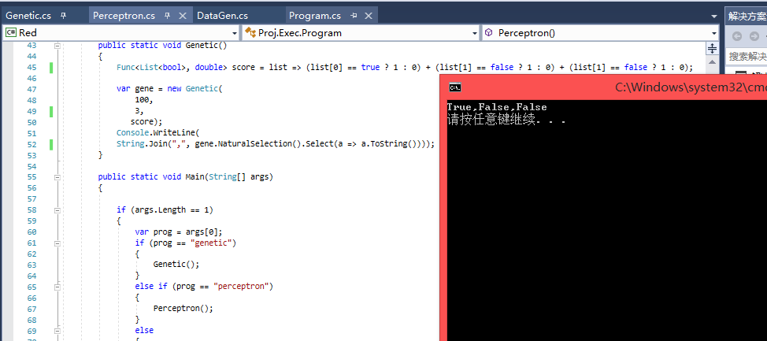

# Linq's so beautiful

## Perceptron

Just Run Perceptron.cs(require C# 7.0 which can be found at VS2017, .NET Core 2.0).  
A few text files will be generated here.
```
    - data.txt # each line contains a list of training data and a piece of target.
    - predict.txt # each line contains a piece of prediction.
    - params.txt # the parametres that can determine the linear expression to make classifications.

```
You can plot figures by use `R` and `Python`.
See `../PlotTools`.

```
# e.g: 
python plot.py datas.txt predict.txt
```

## GA

See [`Program.cs`](./Program.cs), in static function Genetic, and you will get how to use it.

An easy example:
```C#

public static void Genetic()
        {
            // `score` is the a function to give a performance of a species of chromosome.
            Func<List<bool>, double> score = list => (list[0] == true ? 1 : 0) + (list[1] == false ? 1 : 0) + (list[1] == false ? 1 : 0);

            var gene = new Genetic(
                100, // iteration
                3,   // size of chromosome 
                score // score function);
            Console.WriteLine(
            String.Join(",", gene.NaturalSelection().Select(a => a.ToString())));
        }

```
The expected output is `True, False, False`, and it is the final result as well.
[](./genetic.png)


