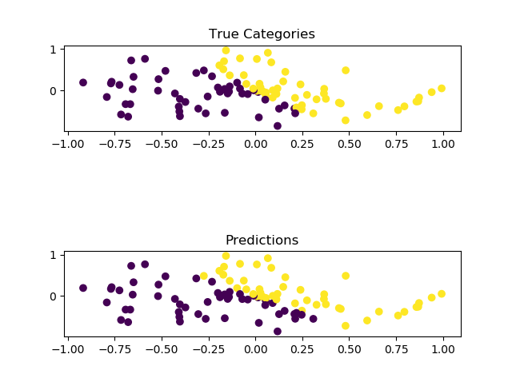
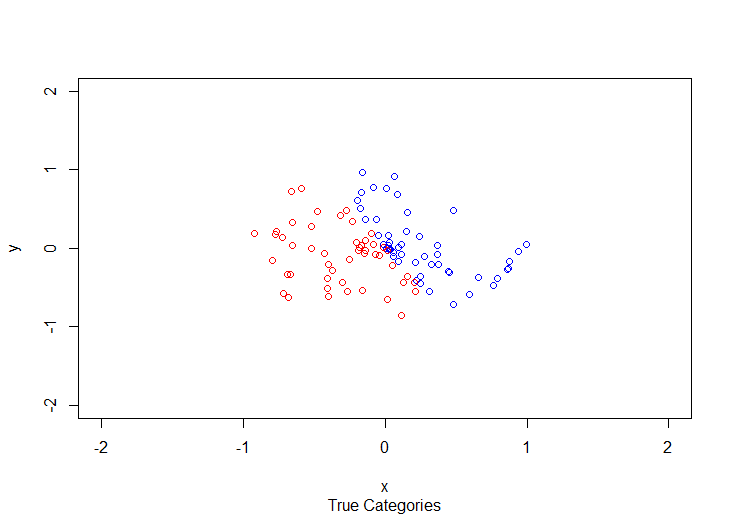
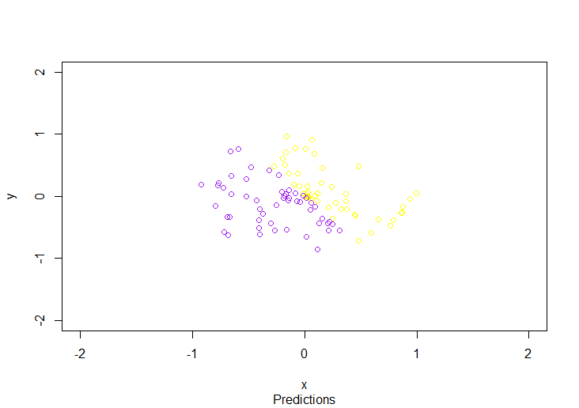

# PLOT TOOLS


# If you use Python, you need

- EBNFParser(for Parsing data files.
- Matplotlib
- NumPy

Example:
```
    python plot.py data.txt predict.txt
```
[](./EG.png)

# If you use R, you 
do not need anything other than R-base.


Change the two variable in `RPlot.R` and execute it is Okay.
- training_data_file   
The filename of you trainning datas(with targets).  
See [data.txt](./data.txt).

- predict_file  
The filename of you predictions.  
See [predict.txt](./predict.txt).

[](./true.png)

[](./pred.png)

