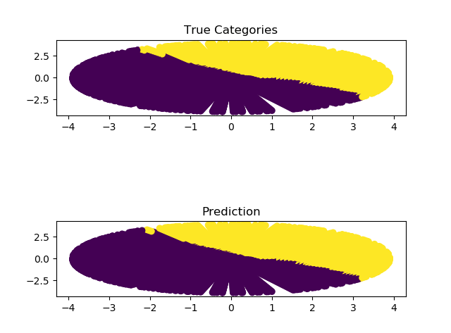

Fast Concurrent Python Programs with JIT optimizations.

# Requirement

- NumPy
- NumBa

# Plot Requirement

- Matplotlib
- NumPy


# Usage

- GA:

    ```shell
    python genetic.py "<function>" size
    # e.g:
    python genetic.py "lambda seq: seq[0]+seq[1]-seq[2]-seq[3]+seq[4]" 5   
    3.0 # max score
    11001 # best chromosome
    ```

- Perceptron

    ```shell
    python perceptron.py <size> "<eq>"
    # e.g
    python perceptron.py 300 "x+y-1"
    ```
    [](./perceptron.png)
